# CSS内联元素垂直渲染初探
Yolin Wu - 铃盛软件Web Application Team <br/>

## 背景
在前端开发中，经常免不了要和内联元素的各种对齐问题做斗争，网上也不乏各种奇技淫巧，本文试图从内联元素垂直渲染的原理角度着手来揭开各种诡异问题的面纱，例如下面这个图片，相在不少同学都曾经遇到过：

<p>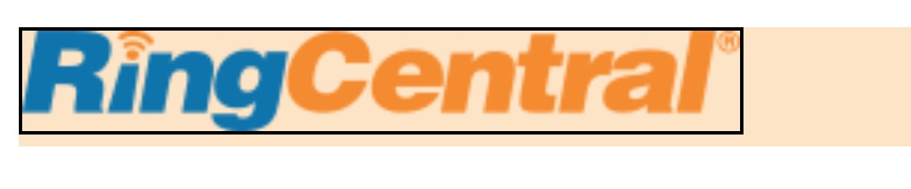</p>

在上图中，图片放置在一行中，底部却莫名其妙出现一个空白区域。这个空白区域究竟怎么产生的？<br/>
其实这个问题仅仅是内联元素垂直渲染过程中会出现的问题之一，在了解内联元素垂直渲染原理后，相信谜底就会解开。
<br/>
让我们开始探索吧！

## 垂直渲染中的几个概念
在探索内联元素垂直渲染的原理之前，我们需要先了解几个重要的概念。
### 1.行盒子和内联级元素
行盒子(line box)和内联级元素(inline-level elements)是非常重要的部分。<a href="https://www.w3.org/TR/CSS21/visuren.html#inline-boxes">W3C</a>对其有专门的解释，总结起来可以这样理解：
* **内联级元素**：指display为inline（行内元素）、inline-block（行内块元素）、inline-table（使用较少，本文不涉及）的元素。
* **行盒子**： 指内联级元素在一行排列形成的行区域。

文章开头提及的图片问题中，图片就是一个内联级元素，而它所在的行则是一个行盒子。

### 2.基线
css在进行垂直方向的排列时，需要根据一条线来进行相应的对齐，这条线就是基线(baseline）。无论内联级元素和行盒子都有基线，并且在默认情况下它们是基线对齐的，即行盒子和内联元素的基线位置会重合。<br/>
基线是看不见的，但是我们可以通过添加一个小写字母"x"来判断它的位置。不同元素判断方法如下：<br/>

##### 行盒子（line-box）: 基线位于小写字母"x"的底部 
##### 行内元素（inline）:同行盒子 
##### 行内块元素（inline-block）:行内块元素的情况较多，需要分别说明。
这边我们假设行盒子中有一个inline-block元素，并且设置它的margin-bottom值，我们在行盒子加上字母"x"方便找到行盒子的基线。
* 无内容的行内块元素：基线位于元素的margin-bottom底部
<p>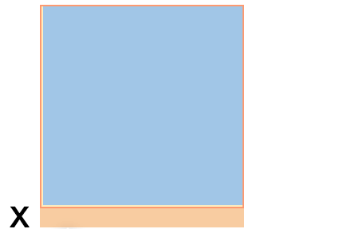</p> 

* 有内容且overflow不为visible的行内块元素：基线与最后一个内容元素的基线重合
<p>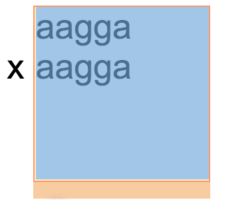</p> 

* 有内容且overflow为visible的行内块元素：基线位于元素的margin-bottom底部
<p>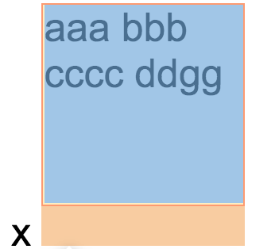</p> 

### 3.文本盒子-"strut"
行盒子中有一个隐藏的区域叫strut，W3C在解释line-height属性时有专门对其进行了定义，我们会在后面详细解释line-height,这里我们先关注"strut"：
> On a block container element whose content is composed of inline-level elements, 'line-height' specifies the minimal height of line boxes within the element. The minimum height consists of a minimum height above the baseline and a minimum depth below it, exactly as if each line box starts with a zero-width inline box with the element's font and line height properties. We call that imaginary box a "strut."

从解释中概括起来，strut是一个宽度为0的inline box，并且有font和line-height属性。<br/>
为了更好显示这个隐藏区域，我们在下面的行盒子中添加一个文本，并且设置了行盒子的背景色，如下图:
<br/>
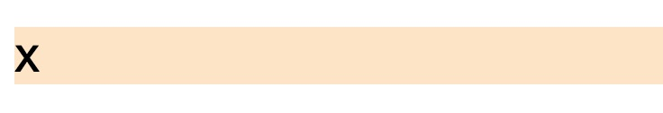
<br/>
在图中黄色区域就是strut，默认情况下：
> strut高度 = strut的line-height = 行盒子的line-height。

当行盒子完全没有内容的时候，strut不会发挥作用。但当行盒子里面有内容时，它就会"偷偷作怪"，导致一些问题，开头提到的图片底部空白问题就和strut有很大的关系，原因我们将会在文章末尾详细解释。
<br/>
<br/>
了解几个重要概念，相信接下来的内容我们会更容易理解。好的，让我们开始最重要的原理解释。


## 垂直渲染与vertical-align

### 1.问题背景
前端开发的页面布局中元素垂直排列是免不了的工作，但是垂直排列相对水平排列就显得"特别不听话"，经常会遇到比较怪异的问题。比如下面的问题：<br>
页面左右有两个固定高度的文本块排列在一行。
```
<p>
    <span>xxx</span><span>aaa</span>
</p>

p {
  background-color: bisque;
  font-family: Times;
}

span{
  width: 50px;
  height: 50px;
  border: 1px solid #000;
  display: inline-block;
}
```
<p>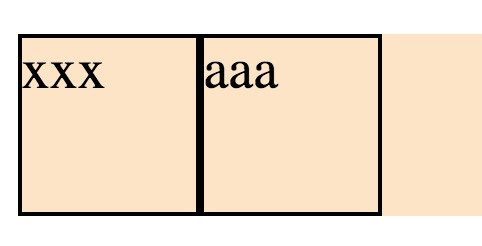</p> 
这时候布局看起来正常，现在我们需要在第二个文本块添加更多文字：
<p>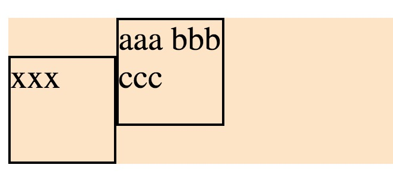</p> 
添加更多文字之后，我们发现布局都乱了，为什么会这样呢？vertical-align就是问题的关键。<br>

### 2.vertical-align的原理
<p>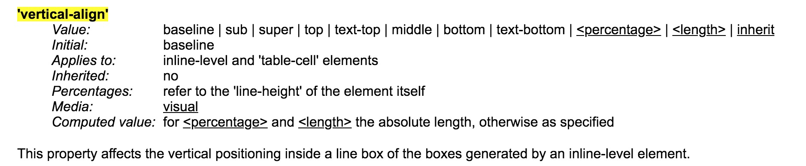</p> 
上面是<a href="https://www.w3.org/TR/CSS21/visudet.html#propdef-vertical-align">W3C</a>对vetical-align的解释。由此可知vertical-align是专门为内联级元素在行盒子的垂直排列所设计的。<br>
不同的取值产生的垂直排列效果是不一样的，下面我们分别来讲述。假设行盒子里面有3个行内块元素和一个行内元素。为了更快找到行盒子的基线我们添加了x字符，为了更好地理解“sub”和“super”我们添加了sub和sup标签。

```
<p>
 x
  <span class="inlineBlock"></span>
  <span class="inlineBlock">aagga</span>
  <span class="inlineBlock inlineBlock_overflow">aaa bbb cccc ddgg</span>
  <span class="inline">afg</span>
  <sub>sub</sub>
  <sup>super</sup>
</p>

p {
  background-color: bisque;
  font-size: 16px;
}

span {
  /* vertical-align: ? */
}

.inlineBlock {
  width: 100px;
  height: 100px;
  border: 1px solid red;
  display: inline-block;
}

.inlineBlock_overflow {
  overflow: hidden;
  margin-bottom: 20px;
}

.inline {
  font-family: Times;
  background-color: red;
  font-size: 100px;
}
```

vertical-align分别取值：
* **baseline（默认）**
<p>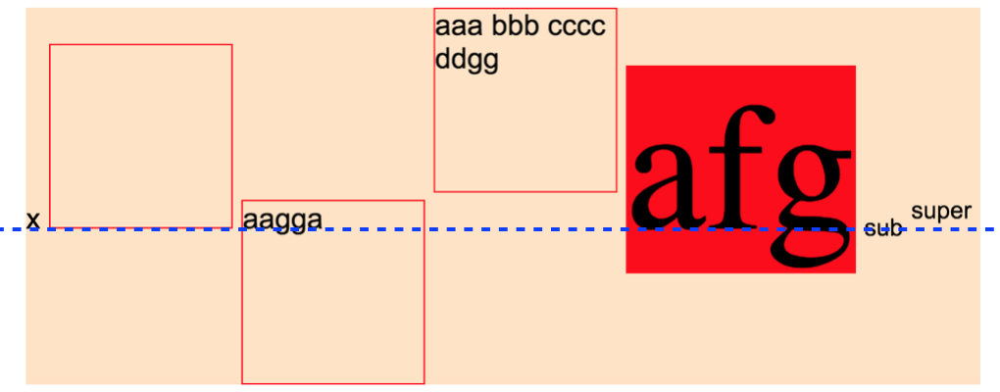</p> 

行盒子基线和内联级元素基线对齐，这是默认值。
* **middle**
<p>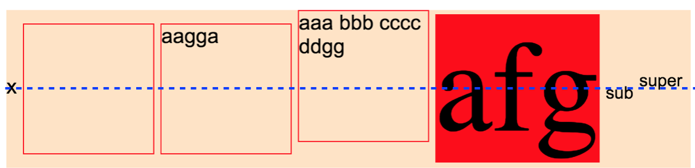</p> 

内联级元素的垂直中线与行盒子的基线往上偏移半个x的位置对齐。

* **sub**
<p>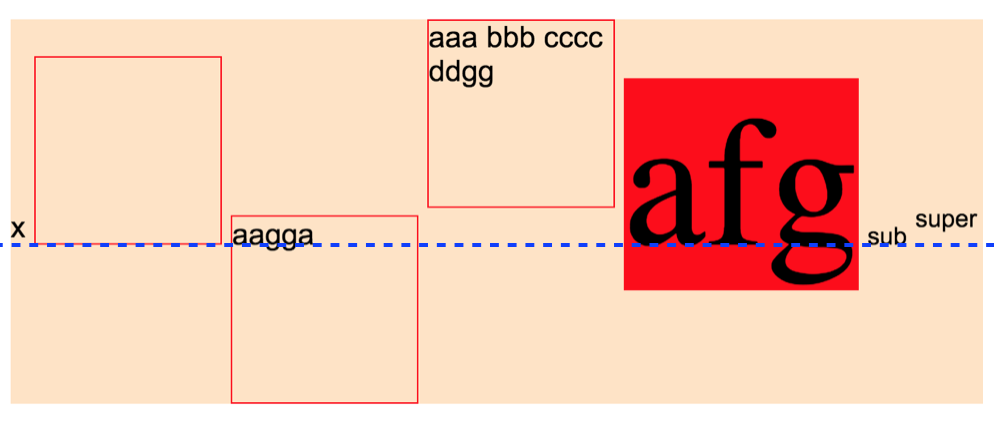</p> 

内联级元素基线与\<sub\>基线重合
* **super**
<p>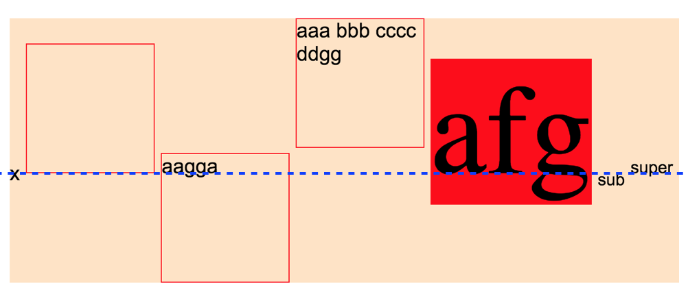</p> 

内联级元素基线与\<sup\>基线重合
* **text-top**
<p>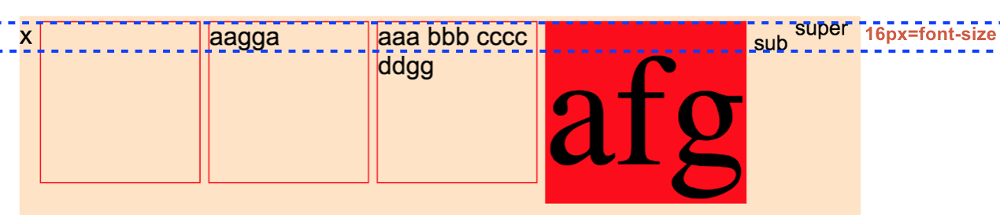</p> 

内联级元素上边界和strut顶部对齐。<br>

**text-bottom**则是与底部对齐

* **top**
<p>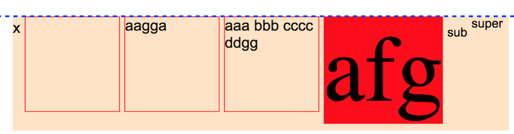</p> 

内联级元素顶部和行盒子顶部对齐，
**bottom**则是与底部对齐
* **\<length\>（eg:10px）**
<p>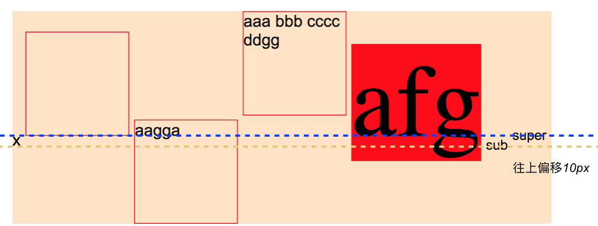"/></p> 

内联级元素的基线往上偏移10px之后和行盒子的基线对齐，注意这里是内联级元素偏移，行盒子的基线位置没变。
**\<percentage\>** 则是往上偏移，偏移量为内联级元素的line-height *  \<percentage\>

回到刚才的问题中，由于在默认情况下，行盒子和内联元是基线对齐的，随着第二个文本块文字的增加，在保持基线对齐的情况下，第二个文本块只能往上偏移，于是出现了布局错乱的情况。<br>
我们再想想文章开头所说的图片底部空白区域问题，谜底可以解开了吗？很抱歉，还不行，因为我们还需要了解另一个重要属性：line-height，它和vertical-align一样对垂直渲染发挥着重要的作用。

## 垂直渲染与line-height
line-height即行高，<a href="https://www.w3.org/TR/CSS21/visudet.html#propdef-line-height">W3C标准解释</a>为：
> On a block container element whose content is composed of inline-level elements, 'line-height' specifies the minimal height of line boxes within the element. 

从解释中，可知line-height代表行盒子的最小高度，包含基线以上最小高度和基线以下最小高度。而line-height与字体的font-family和font-size有关的，具体的关系本文不做详细解释。<br>

## 问题解释
目前为止，本文章需要讲述的所有知识点已经完成，回到我们最开始的问题：图片底部空白区域。<br>
这个问题是strut、vertical-align以及line-height共同作用导致的。为了更好地解释，在这个有问题的行盒子中我们添加一个文本来显示strut区域，并分别设置行盒子和文本的背景色，如下图：<br>
<p></p>

vertical-align默认为baseline，也就是img的基线（图片底部）、strut的基线（字母x的底部）以及行盒子的基线（字母x的底部）是重合的，而strut的本身又有高度（值为line-height），于是共同作用下把底部撑高了一部分，导致了空白区域。根据我们前面讲述的原理，我们可以从几个方面去掉空白区域：
* 设法使strut高度为0，可以设置line-height: 0 或者 font-size: 0;
* 改变垂直排列的方式，比如设置vertical-align: middle。
* 破坏行盒子的形成，可以把img的display设置为除inline、inline-block和inline-table之外的值。这样行盒子就不存在，line-height和vertical-align也没法生效了。

### 总结
css垂直渲染是前端布局中非常重要的知识点，其中vertical-align和line-height是关键的属性。本文章希望能帮助大家对css垂直渲染原理有一定的理解，并且能更加得心应手地处理相关的问题。理论需要结合实践，相信通过多次的实践，大家会更加掌握这部分知识。<br>

### 参考链接
1. W3C: https://www.w3.org/TR/CSS21/visudet.html#propdef-vertical-align https://www.w3.org/TR/CSS21/visudet.html#propdef-line-height <br/>
2. CSS Baseline: The Good, The Bad And The Ugly: https://www.smashingmagazine.com/2012/12/css-baseline-the-good-the-bad-and-the-ugly/#top <br/>
3. Vertical-Align: All You Need To Know (CSS):https://christopheraue.net/design/vertical-align <br/>
4. css vertical-align你真的很了解嘛？: https://zhuanlan.zhihu.com/p/28626505 <br/>
5. CSS深入理解vertical-align和line-height的基友关系: https://www.zhangxinxu.com/wordpress/2015/08/css-deep-understand-vertical-align-and-line-height/ <br/>
