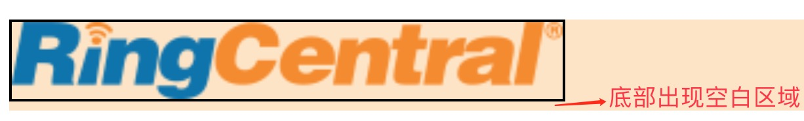
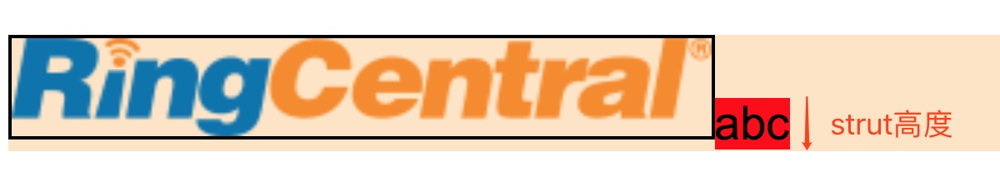

# CSS垂直排列
Yolin Wu - 铃盛软件Web Application Team <br>
<br>
相信很多人在开发这个问题：
 
 <p></p>
 
 如上图，图片底部会出现一个空白区域。可能有经验的开发都知道如何解决，但是这个诡异的空白区域是怎么产生的，却比较少人能解释。这其实是css垂直排列的问题，跟vertical-align和line-height这个两个属性有关系。本文章将致力于讲述这两个属性的原理。<br>
首先我们需要先了解垂直排列中几个比较重要的概念。

## 行盒子与内联级元素
css里面有两个特别重要的概念：行盒子(line box)和内联级元素(inline-level elements).根据<a href="https://www.w3.org/TR/CSS21/visuren.html#inline-boxes">W3C的解释</a>：
* **内联级元素**：包括inline（行内元素）， inline-block（行内块元素）， inline-table元素（本文不涉及）；
* **行盒子**： 内联级元素在一行中一个挨一个地排列形成的行区域。

例如开头的问题中，图片就是一个内联级元素，它所在的行就是一个行盒子。

css在进行垂直方向的排列时，内联级元素和行盒子各自都有一条重要的位置参考线，这条线就是基线(baseline).

* **基线**： 内联级元素和行盒子都有基线，它的位置和小写字母‘x’底部重合，默认情况下内联级元素在行盒子里面是按基线排列。<br>

内联级元素和行盒子的基线分别可以这样判断：

1. **行盒子:** 小写x的底部
2. **行内元素（inline）:** 小写x的底部
3. **行内块元素（inline-block）:** 分下面几种情况，这边我们假设行盒子中有一个inline-block元素，并且设置它的margin-bottom值，我们在行盒子加一个"x"字母方便找到行盒子的基线。下面所说的边距盒子就是指css的盒子模型，边距盒子底部即margin-bottom底部。
* 无内容的行内块元素：基线位于边距盒子底部
<p></p> 

* 有内容且overflow不为visible的行内块元素：基线位与最后一个内容元素的基线重合
<p></p> 

* 有内容且overflow为visible的行内块元素：基线位于边距盒子底部
<p></p> 
了解垂直排列中重要的三个概念，就可以帮助我们更好地理解vertical-align和line-height。


## 垂直排列与vertical-align

### 开发中遇到的问题
前端开发的页面布局中元素垂直排列是免不了的工作，但是垂直排列相对水平排列就显得"特别不听话"，经常会遇到比较怪异的问题。<br>
比如页面左右有两个固定高度的文本块：
```
<p>
    <span>xxx</span><span>aaa</span>
</p>

p {
  background-color: bisque;
  font-family: Times;
}

span{
  width: 50px;
  height: 50px;
  border: 1px solid #000;
  display: inline-block;
}
```
<p></p> 
这是的布局看起来很正常，但是现在我们需要在第二个文本块添加更多文字：
<p></p> 
这时我们发现布局都乱了，为什么会这样呢？在了解vertical-align之后，我们就可以解释原因了。<br>

### vertical-align原理
<p></p> 
根据<a href="https://www.w3.org/TR/CSS21/visudet.html#propdef-vertical-align">W3C的解释</a>，vertical-align是专门为内联级元素在行盒子的垂直排列所设计的。<br>
不同的取值产生的垂直排列效果都是不一样的，下面我们分别来讲述。假设行盒子里面有3个行内块元素和一个行内元素。为了更快找到行盒子的基线我们添加了x字符，为了更好地理解“sub”和“super”我们添加了sub和sup标签。

```
<p>
 x
  <span class="inlineBlock"></span>
  <span class="inlineBlock">aagga</span>
  <span class="inlineBlock inlineBlock_overflow">aaa bbb cccc ddgg</span>
  <span class="inline">afg</span>
  <sub>sub</sub>
  <sup>super</sup>
</p>

p {
  background-color: bisque;
  font-size: 16px;
}

span {
  /* vertical-align: ? */
}

.inlineBlock {
  width: 100px;
  height: 100px;
  border: 1px solid red;
  display: inline-block;
}

.inlineBlock_overflow {
  overflow: hidden;
  margin-bottom: 20px;
}

.inline {
  font-family: Times;
  background-color: red;
  font-size: 100px;
}
```

vertical-align分别取值：
* **baseline（默认）**
<p></p> 

行盒子基线和内联级元素基线对齐，这是默认值。
* **middle**
<p></p> 

内联级元素的垂直中线与行盒子的基线往上偏移半个x的位置对齐。

* **sub**
<p></p> 

内联级元素基线与\<sub\>基线重合
* **super**
<p></p> 

内联级元素基线与\<sup\>基线重合
* **text-top**
<p></p> 

内联级元素上边界和strut顶部对齐。
**text-bottom**则是与底部对齐

* **top**
<p></p> 

内联级元素顶部和行盒子顶部对齐，
**bottom**则是与底部对齐
* **\<length\>（eg:10px）**
<p>"/></p> 

内联级元素的基线往上偏移10px之后和行盒子的基线对齐，注意这里是内联级元素偏移，行盒子的基线位置没变。
**\<percentage\>** 则是往上偏移，偏移量为内联级元素的line-height *  \<percentage\>

了解vertical-align的原理，我们就可以解释刚才说到的问题。由于默认基线对齐，随着第二个文本块文字的增加，在保持基线对齐的情况下，第二个文本块只能往上偏移，于是出现了布局错乱的情况。我们再想想文字开头所说的图片底部空白区域问题能否解释呢？目前为止还解释不了，我们需要了解另一个重要的css属性：line-height，它和vertical-align一样对垂直排列起着重要的作用。

## 垂直排列与line-height
line-height就是行高，<a href="https://www.w3.org/TR/CSS21/visudet.html#propdef-line-height">W3C标准解释</a>是：
> On a block container element whose content is composed of inline-level elements, 'line-height' specifies the minimal height of line boxes within the element. The minimum height consists of a minimum height above the baseline and a minimum depth below it, exactly as if each line box starts with a zero-width inline box with the element's font and line height properties. We call that imaginary box a "strut."

line-height代表行盒子的最小高度，包含基线以上最小高度和基线以下最小高度。line-height与默认字体和字体的font-size有关的，具体的关系本文不做详细解释。<br>
行盒子中有一个隐藏的区域（strut），它可以理解为一个宽度为0的文本盒子，它的行高等于行盒子的行高。它正是导致图片空白区域的"罪魁祸首"。为了更好地解释，我们在行盒子加个文本，并设置它的背景色。<br>
<p></p>

文本区域的高度就是strut的高度。行盒子默认是baseline对齐，也就是img的基线（图片底部）、strut的基线（字母x的底部）以及行盒子的基线（字母x的底部）是重合的，因为strut的本身的line-height高度撑开了底部，从而形成了空白区域。根据我们前面讲述的原理，我们可以从几个方面去掉空白区域：
* 设法使strut高度为0，可以设置line-height: 0 或者 font-size: 0;
* 改变垂直排列的方式，比如设置vertical-align: middle。但是这种方法只有在strut的line-height低于图片高度的情况下才有效，否则修改后顶部或者底部还是被strut撑开；
* 破坏行盒子的形成，可以把img的display设置为除inline、inline-block和inline-table之外的值。这样行盒子就不存在，line-height和vertical-align也没法生效了。

### 总结
css垂直排列是前端布局中非常重要的知识点，其中vertical-align和line-height是关键的属性。通过阅读本文章并且结合实际开发，希望你们可以对垂直排列布局能够熟练掌握。另外，垂直排列的秘密不止这些，其中还包括字体渲染的原理，这部分后面将会有另一篇文章讲述，敬请期待！

### 参考链接
1. W3C: https://www.w3.org/TR/CSS21/visudet.html#propdef-vertical-align https://www.w3.org/TR/CSS21/visudet.html#propdef-line-height 
2. CSS Baseline: The Good, The Bad And The Ugly: https://www.smashingmagazine.com/2012/12/css-baseline-the-good-the-bad-and-the-ugly/#top
3. Vertical-Align: All You Need To Know (CSS):https://christopheraue.net/design/vertical-align
4. css vertical-align你真的很了解嘛？: https://zhuanlan.zhihu.com/p/28626505
5. CSS深入理解vertical-align和line-height的基友关系: https://www.zhangxinxu.com/wordpress/2015/08/css-deep-understand-vertical-align-and-line-height/
